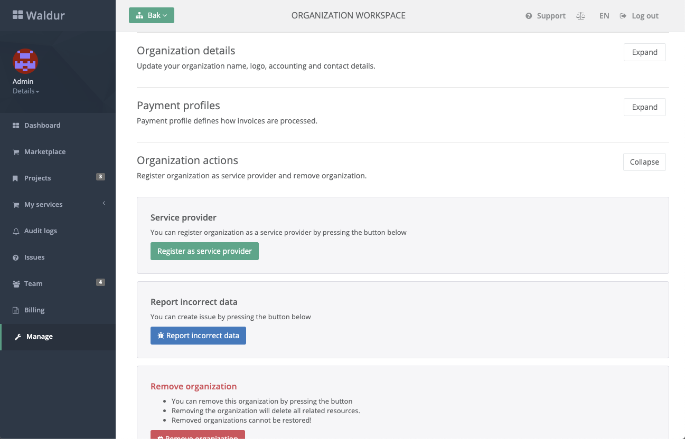
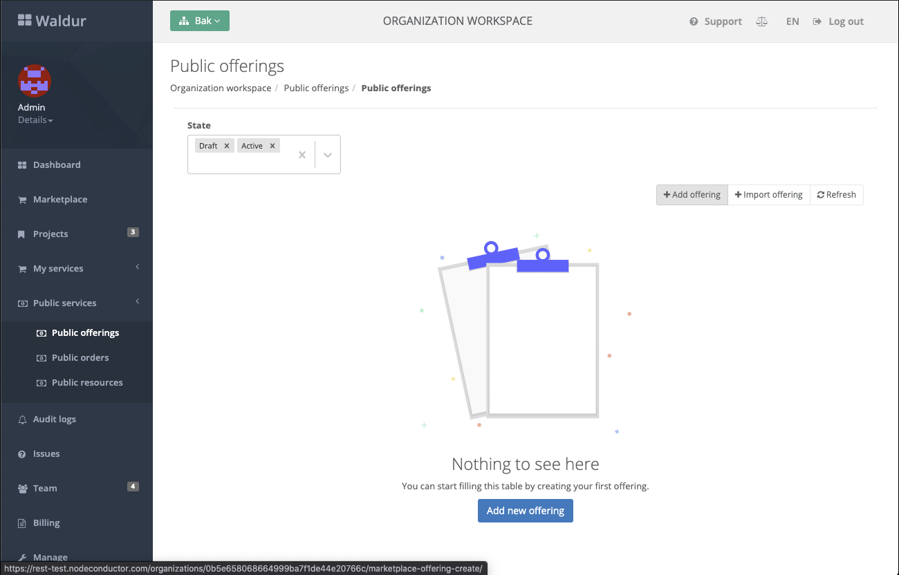
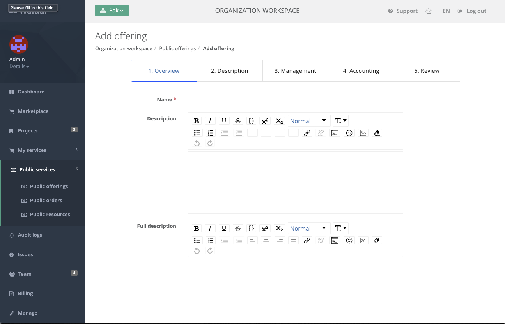
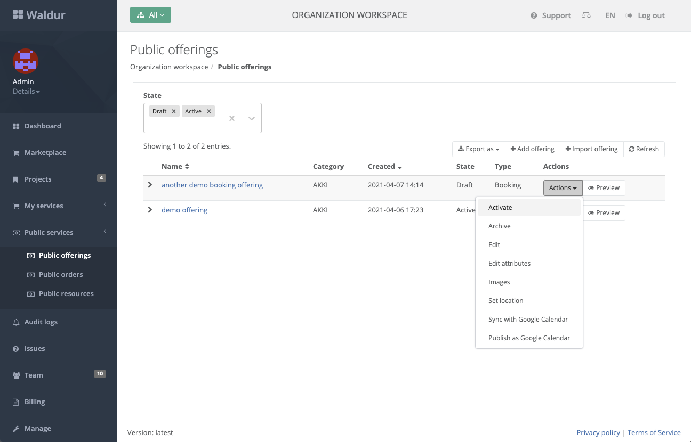

## Introduction

Marketplace is a central module for provisioning of Waldur resources. Marketplace contains Offerings that
belong to a special type of Organizations - Service Providers. Marketplace provides common functionality
for resource lifecycle management, accounting and invoicing. Specifics are implemented in the Marketplace plugins
(e.g. for OpenStack, SLURM, Rancher, etc).

## Terminology

|     Name     |              Description             | Examples |
|:------------:|:------------------------------------:|:--------:|
| Organization  | Legal representation of the entity that can be a client of the Operator. | Ministry A, Department B |
| Project  | Functionality in Self-Service Portal, which allows to group internal resources into projects, which allows to limit access to resources for people.   | Internal systems, Public web |
| Service Provider | Organization can publish offerings in marketplace as soon as it is registered as service provider. | ETAIS, UT HPCC |
| Offering | Service Offering from Service Provider, which can be requested via a Marketplace. Correspond to an entry in the Service Catalogue. | VPS with LB, VDC in DataCenter 1 |
| Category | A grouping of the Offerings defining metadata common to all offerings in this Category. | Compute, Storage, Operations |
| Section | Section is a named aggregate of offering attributes. | System information, Support, Security |
| Attribute | Attribute is an atomic piece of offering metadata, it has name, type and list of options. | Peak TFlop/s, Memory per node (GB) |
| Plan | An option for paying for a particular Offering. There can be multiple options but at each point in time only one Plan can be active. | Small private cloud, Big private cloud |
| Order | A collection of Order items. Considered as done when all Order Items have been processed. | 3 different Offerings with configuration. |
| Order Item | Connects Offering with concrete Organization and configuration settings. | Small VPC with name “test” |
| Resource | Created as part of fulfilling the Order Item. Represents part of the Offering that customer Organization can use. | VM, VPC |
| Category component | Specifies unit of measurement, display name and internal name of the component, which should be present in every category offerings. It is used for aggregating offering component usage and rendering dashboard charts in both project and organization workspace. | vCPU, RAM, storage |
| Offering component | Usage-based component that constitute offering. It may refer to the category component via parent field in order to ensure that component usage is aggregated. | Database count, disk usage |
| Plan Component | Components that constitute a plan. | vCPU, RAM, storage, network bandwidth |
| Component usage | Collects reported resource usage for each plan component separately. | 5 virtual floating IPs for the last month. |

## Diagram of concepts


## Adding a new Offering

To create a new Offering in the Marketplace, you need to:

- Assure that categories are configured in the Marketplace.
- Create at least one service provider.
- Create and activate a public offering.

### Creating a Service Provider

Pick or create an organization that will be used as a service provider. Mark it a such in the Management tab of the
organization using "Register as service provider":



### Creating Marketplace categories

To create a category, either use administrative interface of Waldur, hosted under ```/admin`` (can be accessed by staff users)
or use management command for loading the pre-defined categories.

- With Docker-compose deployment:

```
  docker exec -t waldur-mastermind-worker waldur load_categories  # vpc vm storage ...
```

- With Helm deployment

Open waldur-mastermind-worker shell and execute the following command:

1. Get waldur-mastermind-worker pod name
```
  # Example:
  kubectl get pods -A | grep waldur-mastermind-worker # -->
  # default       waldur-mastermind-worker-6d98cd98bd-wps8n   1/1     Running     0          9m9s
```
2. Connect to pod via shell
```
  # Example:
  kubectl exec -it waldur-mastermind-worker-6d98cd98bd-wps8n -- /bin/bash
```
3. Execute command to see available or add a category
```
  waldur load_categories  # vpc vm storage ...
```

### Creating public Offering

Once you have a service provider and at least one category defined, you can add a new service offering.

- Go to Public services -> Public offerings:



- Fill in details of the offerings.



- Activate an offering (requires staff account) to make it visible in the Marketplace.


